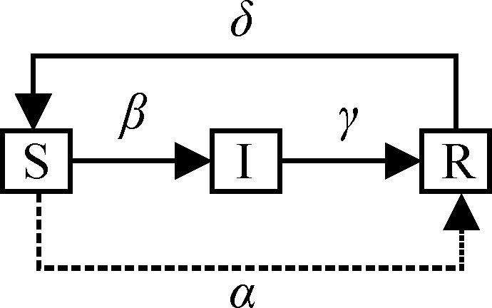

### SIR

>SIR模型是传染病模型中最经典的模型，其中S表示易感者，I表示感染者，R表示移出者。
模型中把传染病流行范围内的人群分成三类：S类，易感者（Susceptible），指未得病者，但缺乏免疫能力，与感病者接触后容易受到感染；I类，感病者（Infective），指染上传染病的人，它可以传播给S类成员；R类，移出者（Removal），指被隔离，或因病愈而具有免疫力的人。

### SIRS模型

