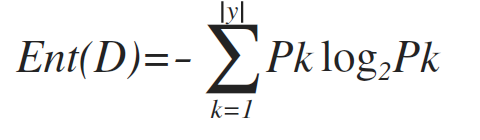
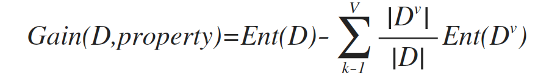

#### 决策树

##### 决策树常用算法
* ID3算法
* C4.5算法
* CART算法

##### 信息增益

"信息熵"是用来度量样本集合纯度常用的一种指标。假定有属性a，属性a对样本集D进行划分，一般而言，信息增益越大，意味着使用属性a来进行划分所获得的"纯度属性"越大。

>ID3算法使用信息增益来选择属性，当信息增益值越大，"纯度提升"越大，也就是选取这种属性。信息增益准则对可取值数目较多的属性有所偏好。所以ID3算法比较适用于离散的描述属性.

信息熵定义：

信息熵越小，数据集D的纯度越高。

信息增益定义：

ID3选取信息增益最大的属性作为划分属性即分支节点。

##### 信息增益率

>信息增益率准则对可取之数目较少的属性有所偏好（连续），算法是使用了一个启发式，先从候选划分属性中找出信息增益高于平均水平的属性，再从中选择增益率最高的。

##### 基尼指数

