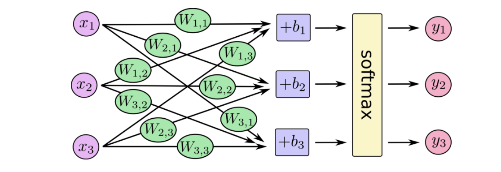
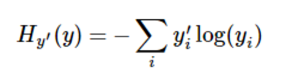

### 基本介绍

##### TensorFlow

* 使用Graph计算
* 在会话(session)的上下文(context)中执行图(Graph)
* 使用tensor(张量)表示数据
* 通过变量(variable)维持状态
* 使用 feed 和 fetch 可以为任意的操作(arbitrary operation) 赋值或者从其中获取数据


###### 概述

TensorFlow使用图(Graph)来表示计算，图中的每个节点称为op(operation),每个op分配0个或者多个tensor(tensor在tensorflow中是一个类型化的多维数组)，执行计算后，产生0个或多个tensor。

图必须在会话中执行，会话将图中op上的tensor分发到各个cpu或gpu上，并且执行op的方法。方法执行后返回相应的tensor。

###### Tensor

TensorFlow中tensor代表所有的数据，在graph中，operation之间传递的都是tensor，可以将tensor理解为n维的数组或列表，一个静态的tensor包括了一个静态的rank，一个shape。

###### 变量

变量在TensorFlow中存放更新参数，在建立模型的时候需要将其显示初始化。在模型训练结束后需要将其存储。


```
# 构造op，并将其存放到变量当中
b = tf.Variable(tf.zeros([1]))
W = tf.Variable(tf.random_uniform([1, 2], -1.0, 1.0))
y = tf.matmul(W, x_data) + b

# 初始化变量
init = tf.initialize_all_variables()

```
###### Fetch

取出计算结果tensor，可以取一个，也可以取出多个tensor。

###### Feed


### MNIST

>MNIST是一个入门级的计算机视觉数据集，它包含各种手写数字图片,它也包含每一张图片对应的标签，告诉我们这个是数字几。


##### softmax regression

为了方便理解，在这里使用了tensorflow官方的关于softmax回归模型的介绍，
softmax模型可以使用以下这张图来概述，对于输入的xs加权求和，再分别加上一个偏置量，最后再输入到softmax函数中。



简单点描述这张图，使用线性代数中矩阵的计算等式来表softmax，如下图。


最后将softmax回归模型可以使用以下的公式表示


##### 训练模型

>为了训练我们的模型，我们首先需要定义一个指标来评估这个模型是好的。其实，在机器学习，我们通常定义指标来表示一个模型是坏的，这个指标称为成本（cost）或损失（loss），然后尽量最小化这个指标。但是，这两种方式是相同的。

* 交叉熵(cross-entropy)




