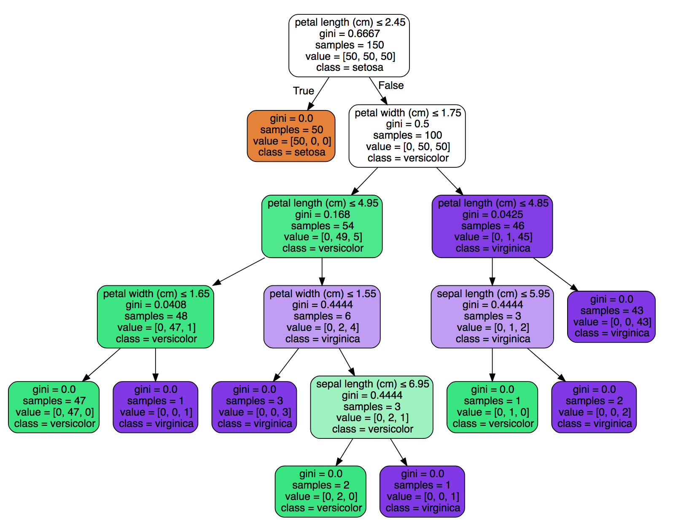
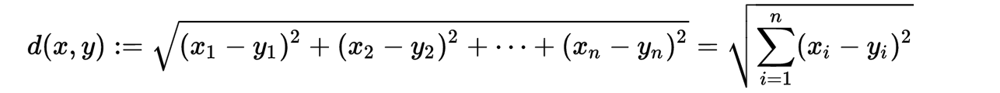

## Google ML

>机器学习可以说是一种可以从样本数据中学习的算法（规则）来取代硬编码过程

* this section is about ML with google

* [URL](https://www.youtube.com/watch?v=tNa99PG8hR8&index=2&list=PLOU2XLYxmsIIuiBfYad6rFYQU_jL2ryal)

### Hello world

#### 工具使用

* [scikit-learn](http://scikit-learn.org/stable/)

* [TensorFlow](https://www.tensorflow.org/)

* [numpy](../numpy.md)

#### 机器学习

* [监督学习](../google/Supervised.md)（Classifer）

Supervised Learing Recipe

收集数据-->训练分类器-->作出预测

>特征：对于一个事物从不同方面的描述，如水果，可以通过颜色，重量，表皮来描述

>标签：某些特征指向下的标示，如水果，颜色，重量等这些特征的指向标示为某类水果即为标签

数据分类

>训练数据集：训练集用来估计模型（训练模型或确定模型参数）

>测试数据集：测试集则检验最终选择最优的模型的性能如何，但并不能保证模型的正确性，只是说相似的数据用此模型会得出相似的结果

输入：数据（特征以及标签）

输出：所分配的标签

示例分类器算法（决策树）

如程序`HelloWord.py`.

### 可视化决策树



 简单易读
 便于理解
 可解释的分类器

* 数据来源

来自于[scikit-learn](http://scikit-learn.org/stable/)当中的
iris数据集。

* 数据处理

将数据集分成两组，分别是测试数据集和训练数据集，测试数据集用来检测分类器的正确性；
训练数据集用来训练合适的分类器。

* 使用决策树

使用决策树训练数据并且使用测试数据集测试分类器的正确。

* 决策树使用注意事项

1.决策树提出的问题必须针对某个特征

2.特征越可靠，决策树越趋于正确

### 分类器特征选择

1.通过特征提供的信息更有用

2.特征具有独立性，可以通过特征直接判断

3.更简单

### 编写管道

函数 f(x) = y

我们可以将监督学习当中的特征看作是x，即为函数输入，标签看作是y,即为函数输出。

```
  def classify(features):
     #TODO learn algorithem
     return label

```

### 编写自己的分类器（KNN）

>在模式识别领域中，最近邻居法（KNN算法，又译K-近邻算法）是一种用于分类和回归的非参数统计方法。[1]在这两种情况下，输入包含特征空间中的k个最接近的训练样本。

>在k-NN分类中，输出是一个分类族群。一个对象的分类是由其邻居的“多数表决”确定的，k个最近邻居（k为正整数，通常较小）中最常见的分类决定了赋予该对象的类别。若k = 1，则该对象的类别直接由最近的一个节点赋予。

>在k-NN回归中，输出是该对象的属性值。该值是其k个最近邻居的值的平均值。

* purpose

使用之前有关分类器的基础知识及数据集，达到所编写KNsN分类器预测准确率达90%以上。

* 计算两点距离

>欧式距离也称为欧几里得距离，也可以称为度量距离。它可以计算出欧式空间中无论所计算两点在几维空间中的距离。
在欧几里得空间也可称为欧式空间或度量空间当中，点x=(x1,...,xn)和y=(y1,...,yn)(n代表空间维度)之间的欧式距离为




### 图像分类器

[TensorFlow for Poets](https://codelabs.developers.google.com/codelabs/tensorflow-for-poets/#0)

 TF-Learn

* 收集训练数据

为每种类型的训练图像数据创建一个文件夹，在文件夹中放入同类型的图像。如：训练关于花的分类器
就要为每种类型的花创建一个文件夹，然后在每个文件夹下放入同类型花的图像。


