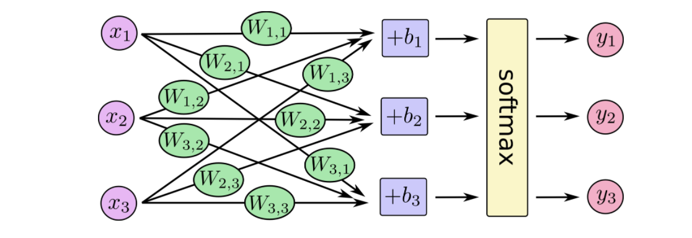
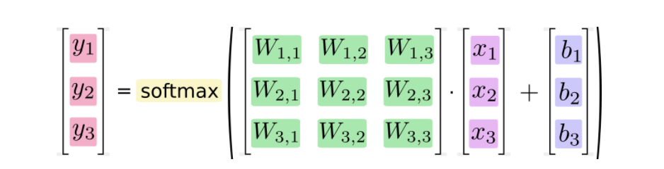
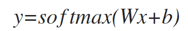
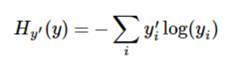

### MNIST

>MNIST是一个入门级的计算机视觉数据集，它包含各种手写数字图片,它也包含每一张图片对应的标签，告诉我们这个是数字几。

##### softmax regression

为了方便理解，在这里使用了tensorflow官方的关于softmax回归模型的介绍，
softmax模型可以使用以下这张图来概述，对于输入的xs加权求和，再分别加上一个偏置量，最后再输入到softmax函数中。

简单点描述这张图，使用线性代数中矩阵的计算等式来表softmax，如下图。

最后将softmax回归模型可以使用以下的公式表示

##### 训练模型

>为了训练我们的模型，我们首先需要定义一个指标来评估这个模型是好的。其实，在机器学习，我们通常定义指标来表示一个模型是坏的，这个指标称为成本（cost）或损失（loss），然后尽量最小化这个指标。但是，这两种方式是相同的。

* 交叉熵(cross-entropy)

