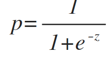
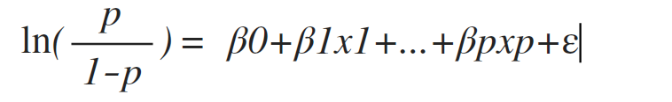

#### Logistic Regression(对数几率回归)

* Logistic 函数
* Logistic 模型

##### Logistic 函数

* 因变量只有0和1
* 在相对独立的情况下，取0的概率为p,取1的概率为1-p，取0取1的概率比为p/1-p(称为事件的优势比)
* Logistic 函数(sigmoid)为

##### Logistic 模型

* 建立在Logistic函数之上

* Logistic 回归模型 : 

>特征选择
>(1)递归特征选择：在构建模型的过程中反复基于已选择好的特征中挑选最好的或者最差的特征，直到遍历晚特征
>(2)稳定性选择：在不同的数据子集和特征子集上运行特征徐选择算法，不断重复，最终汇总。

